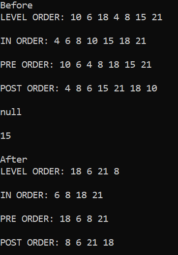

# Binary-Search-Tree
A binary search tree was created with put, remove, get functions.
This tree can be printed in level order pre-order, post-order, and inorder traversal.

	10 
     /      \  
    6         18 
  /   \      /   \ 
 4     8    15   21 
      
      
  
